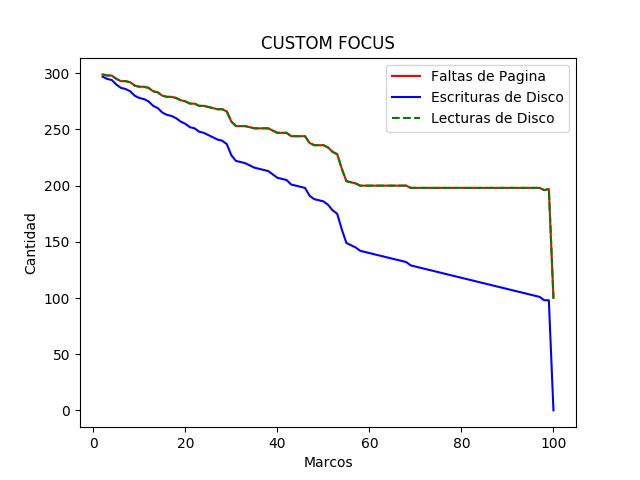
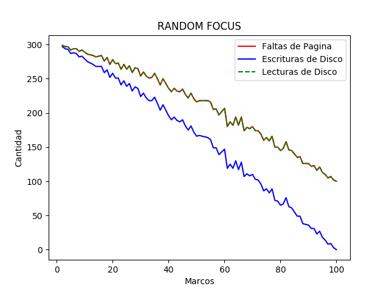
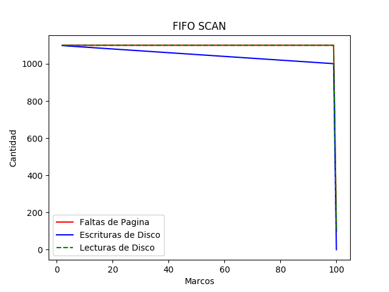
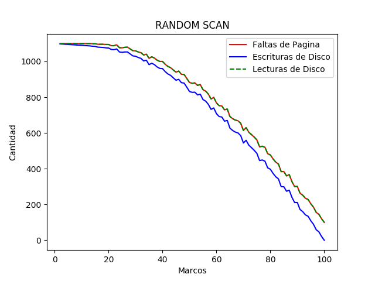
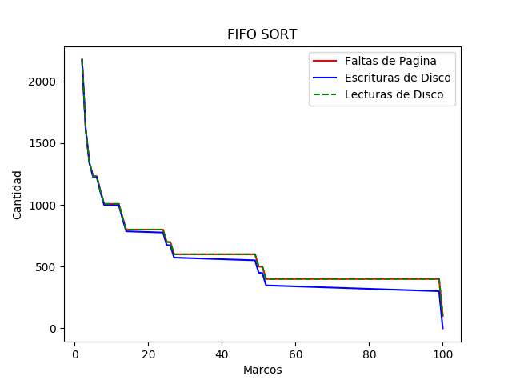

Integrantes:
- Raimundo Marin
- Pedro Grand

Lo esperado:

El algoritmo custom que implementamos, se basaba en utilizar un indexador del frame en el cual se hará un cambio de página, para asi la proxima vez que halla una falta de página, cambiará la página cargada en el frame index + 1, asi sucesivamente hasta llegar al último frame para reiniciar el indexador.
Esperamos que este algorimo tenga un comportamiendo similar al del FIFO, ya que se su mecanismo es parecido al de este último.
Para el algoritmo FIFO, se espera que halla una disminución lineal de las faltas de página.
Para el algoritmo Random, se espera tambien una disminución lineal de faltas de página.

Analisis de Resultados:

Para el algoritmo custom, al igual que el FIFO, tuvieron un comportamiento similar en cuanto a faltas de página como se había esperado, pero no asi con respecto al rendimiendo, en los gráficos pudimos notar que las faltas de página disminuyen muy levemente, hasta que se acercan a los 98 marcos en el programa SCAN. Para el programa FOCUS, los resultados obtenidos se asimilan mas a la hipótesis que teniamos respecto al comportamiendo del algoritmo. Para sort, los resultados muestran un crecimiento exponencial de faltas de página a medida que la cantidad de marcos disminuye. 
Para el algoritmo de reemplazo RANDOM, con el programa FOCUS, nuestra hipótesis se acerca bastante al resultado obtenido en los gráficos. Para el programa SCAN, podemos notar que claramente este es el algoritmo que menos faltas de página produce, ya que en la gráfica vemos una disminución exponencial desde los 20 marcos hasta 100, a diferencia de los algoritmos custom y FIFO que su disminución de faltas de página se puede notar desde los 98 marcos. Para el programa SORT, podemos ver que las faltas de página decrementan rápidamente al aumentar los marcos hasta 20, para después disminuir linealmente las faltas de página.

Ademas en todos los gráficos podemos notar que las faltas de página son las mismas que las lecturas de disco, esto se debe a que cada vez que ocurra una falta de página tendremos que ir al disco a leer esta para cargarla, por otro lado, las escrituras en el disco siempre son menores que las lecturas, pero la difencia entre estas se vuelve mayor a medida que hay mas marcos, esto se debe a que mientras mas marcos, menos páginas tendremos que descargar de la memoria, es decir menos veces tendremos que escribir en el disco.

En suma, analizando todos los resultados y gráficos obtenidos, pudimos concluir que el algoritmo de reemplazo con mejor rendimiento sumando los 3 programas es el de reemplazo RANDOM.

1.Grafico Custom Focus

2.Grafico Fifo Focus

3.Grafico Random Focus

4.Grafico Custom Scan

5.Grafico Fifo Scan

6.Grafico Random Scan

7.Grafico Custom Sort

8.Grafico Fifo Sort

9.Grafico Random Sort

